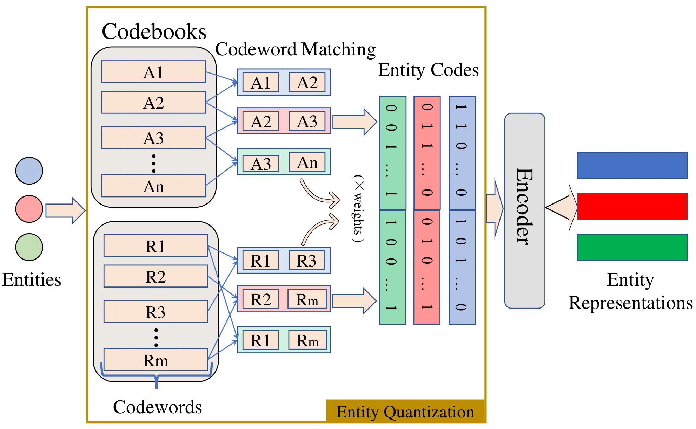

# RandomQuantization
Release the code of
[Random Entity Quantization for Parameter-Efficient Compositional Knowledge Graph Representation](https://arxiv.org/abs/2310.15797#). 
This paper has been accepted by **EMNLP 2023** main conference.

<div  align="center">  

</div>  

## Preparation
### Enviroment
The code is tested under ```torch==1.12.0``` and ```dgl==1.0.0```. The requirements of specific version is not very strict. Run with no bugs, then you are set.
### Data
Datasets we used are in ```./data```. Unzip the files before using them. If you want to run without the random entity quantization and test the original EARL quantization strategy, please use ```pre_process.ipynb``` to process the data.

## Run
Run the random entity quantization by running ```bash run.sh```.

In this script, you can open ```--code_level_distinguish``` and ```--codeword_level_distinguish``` to view the entropy and nearest neighbor Jaccard distance of the entity codes. Experiments are tracked by [WandB](https://wandb.ai/site) if setting ```--wandb True```.

## Acknowledgement
This repo benifits from [NodePiece](https://github.com/migalkin/NodePiece) and [EARL](https://github.com/zjukg/EARL). Thanks for their wonderful works.

## Contact and Citations
Feel free to leave issues or [contact us](mailto:jali@mail.ustc.edu.cn) if you have any questions.
If you find this repo useful, please cite our paper as (will be updated after EMNLP2023 proceeding is available):
```
@article{li2023random,
  title={Random Entity Quantization for Parameter-Efficient Compositional Knowledge Graph Representation},
  author={Li, Jiaang and Wang, Quan and Liu, Yi and Zhang, Licheng and Mao, Zhendong},
  journal={arXiv preprint arXiv:2310.15797},
  year={2023}
}
```
